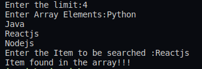

## :question: Define a class ‘product’ with data members pcode, pname and price. Create 3 objects of the class and find the product having the lowest price
___
 

## :fast_forward: Output

 

</img> 
