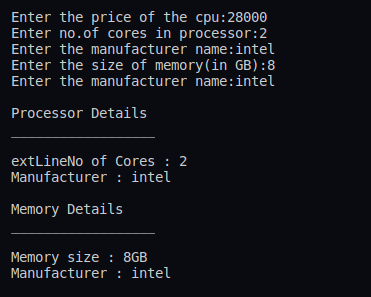

## :question: Create CPU with attribute price. Create inner class Processor (no. of cores, manufacturer) and static nested class RAM (memory, manufacturer). Create an object of CPU and print information of Processor and RAM.
___
 

## :fast_forward: Output

 

</img> 