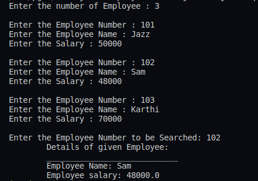

## :question: Program to create a class for Employee having attributes eNo, eName eSalary. Read n employ information and Search for an employee given eNo, using the concept of Array of Objects
___
 

## :fast_forward: Output

 

</img> 