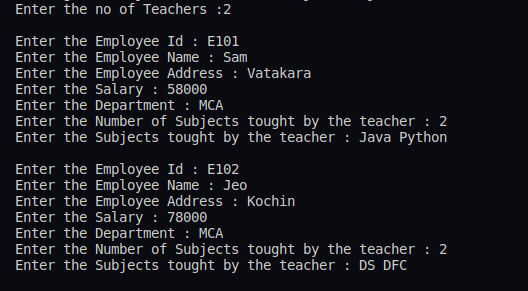
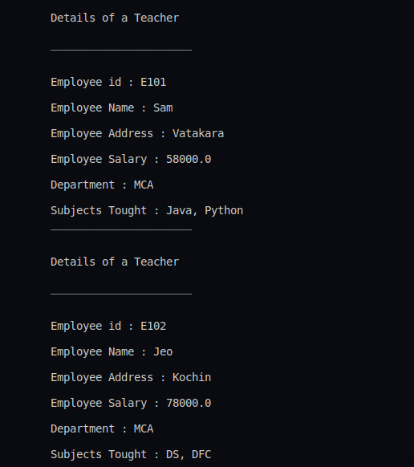

## :question: Create a class ‘Employee’ with data members Empid, Name, Salary, Address and constructors to initialize the data members. Create another class ‘Teacher’ that inherit the properties of class employee and contain its own data members department, Subjects taught and constructors to initialize these data members and also include display function to display all the data members. Use array of objects to display details of N teachers.
___
 

## :fast_forward: Output

 

</img> 
</img> 
