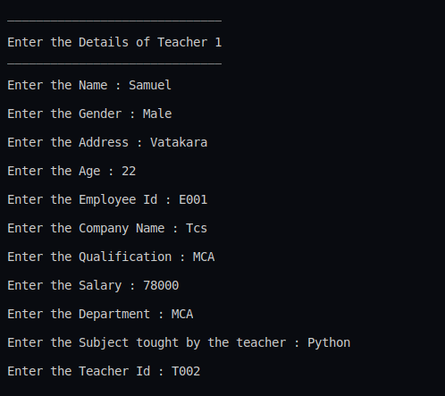
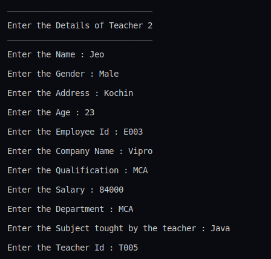
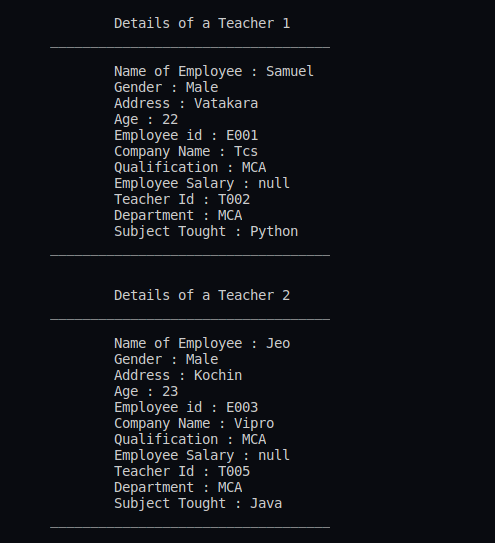

## :question: Create a class ‘Person’ with data members Name, Gender, Address, Age and a constructor to initialize the data members and another class ‘Employee’ that inherits the properties of class Person and also contains its own data members like Empid, Company_name, Qualification, Salary and its own constructor. Create another class ‘Teacher’ that inherits the properties of class Employee and contains its own data members like Subject, Department, Teacherid and also contain constructors and methods to display the data members. Use array of objects to display details of N teachers.
___
 

## :fast_forward: Output

 

</img> 
</img> 
</img> 