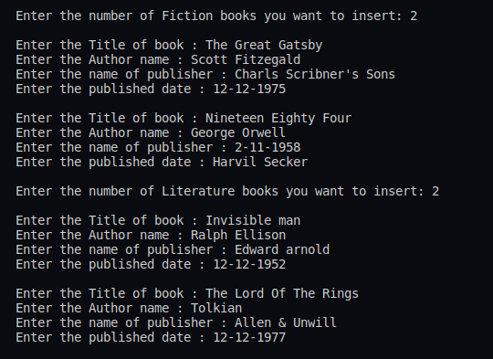
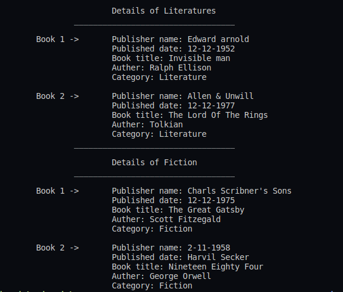

## :question: Write a program has class Publisher, Book, Literature and Fiction. Read the information and print the details of books from either the category, using inheritance.
___
 

## :fast_forward: Output

 

</img> 
</img> 