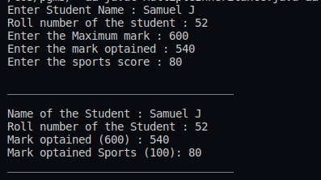

## :question: Create classes Student and Sports. Create another class Result inherited from Student and Sports. Display the academic and sports score of a student.
___
 

## :fast_forward: Output

 

 