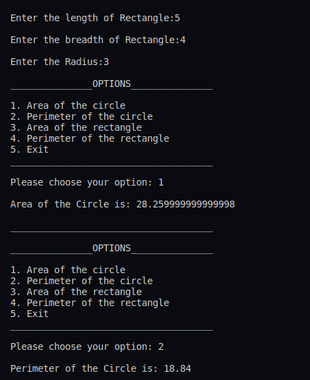
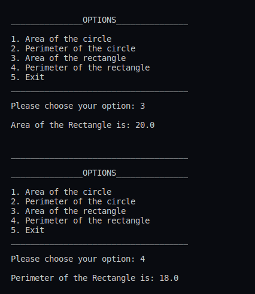
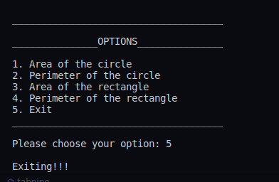

## :grey_question: Create an interface having prototypes of functionsarea() and perimeter(). Create two classes Circle and Rectangle which implements the above interface. Create a menu driven program to find area and perimeter of objects.

___
 
 

## :fast_forward: Output
___
 

</img>
</img>
</img>