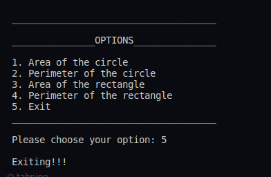

## :question: Create an interface having prototypes of functionsarea() and perimeter(). Create two classes Circle and Rectangle which implements the above interface. Create a menu driven program to find area and perimeter of objects.
___
 

## :fast_forward: Output

 

</img> 
</img> 
</img> 