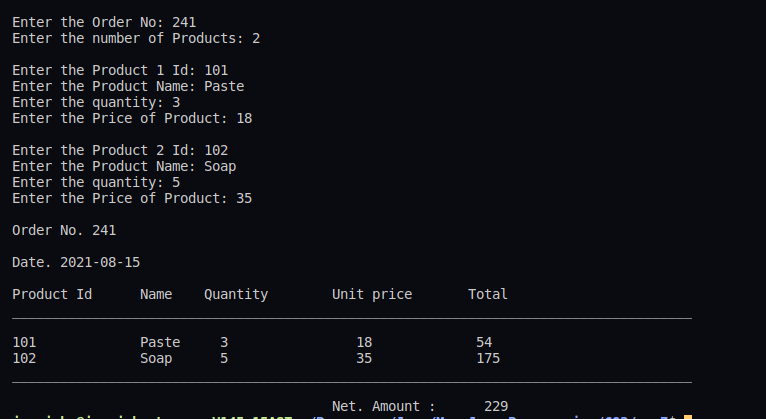

## :question: Prepare bill with the given format using calculate method 
from interface.

Order No.
Date :

Product Id | Name | Quantity | unit price | Total
:---: | :---: | :---: | :---: | :---: | :---: | :---: 
101 | A | 2 | 25 | 50 
102 | B | 1 | 100 | 100
| | | | Net.Amount |150
___
 

## :fast_forward: Output

 

</img> 