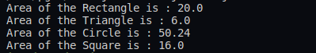

## :question: Create a Graphics package that has classes and interfaces for figures Rectangle, Triangle, Square and Circle. Test the package by finding the area of these figures.
___
 

## :fast_forward: Output

 

</img> 