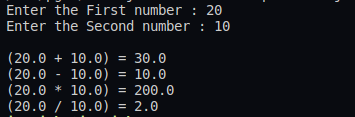

## :question: Create an *Arithmetic package* that has classes and interfaces for the 4 basic arithmetic operations. Test the package by implementing all operations on two given numbers
___
 

## :fast_forward: Output

 

</img> 