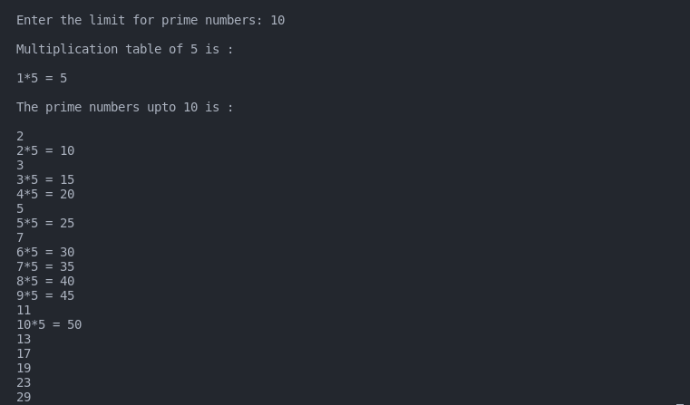

## :question: Define 2 classes; one for generating multiplication table of 5 and other for displaying first N prime numbers. Implement using threads. (Thread class)
___
 

## :fast_forward: Output

 

</img> 