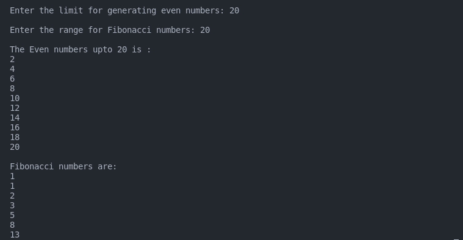

## :question: Define 2 classes; one for generating Fibonacci numbers and other for displaying even numbers in a given range. Implement using threads. (Runnable Interface)
___
 

## :fast_forward: Output

 

</img> 