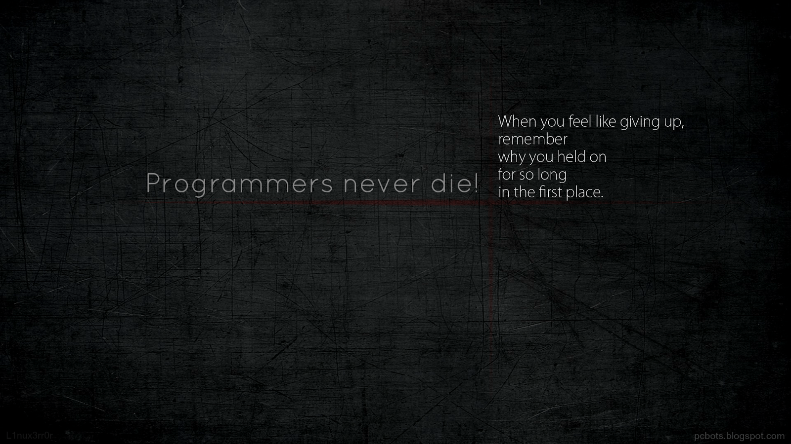

<!--  -->

___

# :fire: Java OOP Problems & Solutions

 

> ## :memo: Main concepts covered
 

- [x] Classes and Objects
- [x] Constructors and Method Overloading
- [x] Arrays and strings
- [x] Inheritance and Multiple Inheritance
- [x] Method Overriding and Abstraction
- [x] Interfaces and Packages
- [ ] Collection Framework(ArrayList,LinkedList,Stack,Ques,Set,Map)
- [ ] Exception Handling
- [ ] Multithreading
- [ ] Generic Problems
- [ ] Applet,Graphics-2D
- [ ] Event Handling in Applet
- [ ] File
- [ ] Socket Programming

